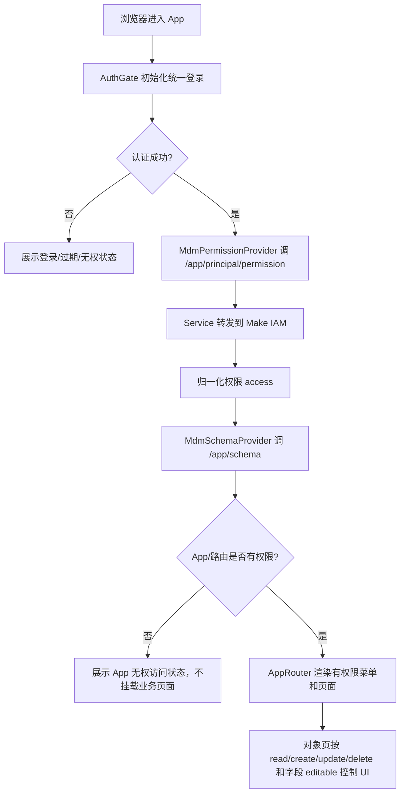

# Make App 单应用权限 Skill 规划

## 1. 背景和目标

当前 Make 平台已经具备两条权限链路：

- `make-console` 负责后台权限配置：包括平台管理权限、单个 App 的权限组、成员、策略、对象、操作和字段权限配置。
- 参考 Make App 已经把单个 App 权限应用到前台：登录后拉取当前用户在当前 App 下的权限集合，并用这些权限控制菜单、列表、详情、按钮、单元格编辑、表单字段编辑和刷新后的权限重算。

本规划的目标是在 `make-platform-skills/skills` 中新增标准 skill，让后续使用 `makecli`、DSL 和 Make 平台 skills 生成或改造 Make App 时，默认把单个 App 权限链路做完整，尤其是：

- 单个 App 权限是 Make 项目的默认必备能力，不是可选增强；除非用户明确说明不接权限，否则生成 Make 项目时必须包含权限链路。
- 区分平台级权限和单个 App 权限，避免用错 scope、resource 或 permissionKey。
- 明确 `/principal/permission` 的 Service 调用方式、参数、gateway path 和转发登录态规则。
- 明确前台权限配置模型、调用时机、运行流程、刷新策略和页面落点。
- 给 AI 生成项目时提供可执行的检查清单和测试要求。

## 2. 已调研代码基线

### 2.1 make-console 后台权限配置

后台权限相关代码主要位于：

- `make-console/src/api/service/make-platform-admin.ts`
- `make-console/src/api/service/make-platform-admin-model.ts`
- `make-console/src/api/service/make-app-permission.ts`
- `make-console/src/api/service/make-app-permission-model.ts`
- `make-console/src/pages/app-console/permissions/index.tsx`
- `make-console/src/pages/app-console/permissions/components/permission-config/*`

平台权限的特征：

- permissionKey 是 `make.platform.org`、`make.platform.admin`、`make.platform.permission`、`make.platform.app`、`meta.app.read`、`meta.app.create`、`meta.app.delete`。
- scope 是租户根资源：`make://<tenantId>`。
- app 管理资源是：`make://<tenantId>/meta/app`。
- 调用 `/iam/v1/principal/permission` 时带固定 filter，只取平台权限 key。
- 结果用于 make-console 自身的管理菜单和路由过滤，不是业务 App 前台要使用的权限模型。

单个 App 权限配置的特征：

- 权限组接口走 `/console/v1/permissions/groups/*`。
- 对象候选接口走 `/meta/v1/entity`，`X-Make-Target: MakeService.ListResources`。
- 权限策略是 `Make.IAM.Policy`，保存时按 `appKey`、`key`、`rules`、`subjects.users`、`subjects.departments` 组织。
- 单个对象 resource 是 `make://<tenantId>/meta/app/<appKey>/entity/<entityKey>`。
- 操作 permissionKey 包括：
  - `data.record.read`
  - `data.record.create`
  - `data.record.update`
  - `data.record.bulkUpdate`
  - `data.record.delete`
  - `data.record.*`
  - `*.*.*`
- 字段权限通过 `fieldCondition.fields` 表达，字段 access 包括 `hidden`、`readonly`、`editable`、`partialMask`、`fullMask`。
- 行级数据条件通过 `dataCondition.expression` 表达，前台不处理行级判断，后端数据接口负责处理。

### 2.2 参考 Make App 前台权限应用

前台权限相关代码主要位于：

- `apps/service/src/make/makeIamClient.js`
- `apps/service/src/permissions/permissionRoutes.js`
- `apps/service/src/app.js`
- `apps/ui/src/App.jsx`
- `apps/ui/src/lib/service-api/permissions.js`
- `apps/ui/src/features/permissions/PermissionContext.jsx`
- `apps/ui/src/features/permissions/principalPermissionModel.js`
- `apps/ui/src/features/objects/SchemaObjectPage.jsx`
- `apps/ui/src/features/dictionaries/DictionaryCenterPage.jsx`

参考 Make App 的关键运行链路：

```text
AuthGate
  -> MdmPermissionProvider
    -> MdmSchemaProvider
      -> AppRouter
        -> object/dictionary pages
```

这个顺序必须保留：权限加载必须发生在认证完成后，schema 和页面消费权限时必须能读到权限上下文。

UI 调用链路：

```text
UI createPrincipalPermissionApi(auth)
  -> auth.api.get("/app/principal/permission")
  -> browser GET /api/make/app/principal/permission
  -> Service registerPrincipalPermissionRoutes(prefix="/api/make/app")
  -> makeIamClient.getPrincipalPermissions(requestContext)
  -> POST <make-gateway-origin>/api/make/iam/v1/principal/permission
```

Service 访问 IAM 的关键规则：

- IAM 接口是 `POST /api/make/iam/v1/principal/permission`，`X-Make-Target: MakeService.GetResource`。
- Service env 中 gateway origin 不能包含 `/make` 或 `/api/make`，scope 由 adapter 拼。
- 发布态 Meta/Data/Auth 使用 `/make`，但 IAM 权限接口使用 `/api/make`。
- 本地 preview 使用 public gateway origin + `/api/make`。
- body 默认只传 `{ scope: "make://<tenantId>/meta/app/<appKey>" }`，不要默认带平台权限 filter。
- 只有诊断或明确要求指定 permissionKey 时才带 `filter.expression`。
- Cookie、Authorization、`X-Forwarded-Host`、`X-Forwarded-Proto` 等登录上下文必须从浏览器请求转发到 gateway。
- tenantId 优先从 env 或请求头读取，缺失时通过 `/make/auth/current-context` 获取当前上下文再解析。

前台权限消费模型：

- `normalizePrincipalPermissionAccess(payload)` 归一化 principal、scope、appResource 和 permissions。
- `canUseEntityOperation(access, entityKey, permissionKey)` 判断对象级操作权限。
- `canEditEntityField(access, entityKey, fieldKey, permissionKey)` 判断字段能否编辑。
- `editableFieldKeysForEntity(access, entityKey, fields, permissionKey)` 计算创建或编辑可编辑字段集合。
- permissionKey 匹配支持精确匹配、`data.record.*`、`*.*.*` 和三段式通配。
- resource 匹配按优先级选择：实体精确资源、实体通配、app 级 resource、父级 resource、`*`。
- 存在 deny 时优先 deny。
- allow 且没有 fieldAccess 约束时表示字段不受限；有 fieldAccess 时只有 `editable` 才允许编辑。

## 3. 权限边界定义

### 3.1 平台级权限

平台级权限只用于 make-console 管理后台，例如组织管理、管理员、权限查询、App 管理菜单。它的 scope 和 resource 都是租户或租户下 app 管理集合：

```text
scope:    make://<tenantId>
resource: make://<tenantId>
resource: make://<tenantId>/meta/app
```

平台级 permissionKey 示例：

```text
make.platform.org
make.platform.admin
make.platform.permission
make.platform.app
meta.app.read
meta.app.create
meta.app.delete
```

生成业务 App 前台权限时不能使用这套 filter，也不能用这套结果判断业务页面按钮。

### 3.2 单个 App 权限

单个 App 权限用于某个 App 内的业务对象、操作和字段。它的 scope 是 App：

```text
scope: make://<tenantId>/meta/app/<appKey>
```

对象资源常见形态：

```text
make://<tenantId>/meta/app/<appKey>
make://<tenantId>/meta/app/<appKey>/entity/<entityKey>
make://<tenantId>/meta/app/<appKey>/entity/*
*
```

前台只消费单个 App 权限结果，不消费 make-console 平台菜单权限结果。

### 3.3 schema 和 permission 的分工

schema 接口和 permission 接口必须分工明确：

- `/api/make/app/schema`：返回当前用户有权限看到的对象，以及对象下可见字段。它决定菜单和字段展示。
- `/api/make/app/principal/permission`：返回当前用户在当前 App 下的操作权限和字段编辑权限。它决定列表/详情是否可读、新建/编辑/删除按钮是否展示、表格单元格是否可编辑、表单字段是否可编辑。
- 路由进入权限：前端路由必须以 schema 返回的可访问对象和显式绑定的页面权限为准。用户不能通过手动修改 URL 进入未授权 App、未授权对象页或未授权固定页面。
- 行级数据权限：前端不处理，后端记录接口和 Make Data API 处理。

## 4. 前台运行流程

### 4.1 首次进入 App



### 4.2 对象列表页

对象页必须按下面规则消费权限：

- `data.record.read`：没有 read 时，不触发列表 hook、`onDataLoad` 和详情请求，展示无查看权限状态。
- `data.record.create`：有 create 且至少存在一个可编辑字段时，才展示或启用新增入口。
- `data.record.update`：有 update 且至少存在一个可编辑字段时，才展示或启用编辑入口。
- `data.record.delete`：有 delete 才展示或启用删除入口。
- 单元格编辑：字段必须在 update 的可编辑字段集合内，否则 `onCellEditCommit` 不可用或提交前返回 forbidden。
- 表单字段：创建用 create 字段权限，编辑用 update 字段权限；无编辑权限字段不展示或禁用，提交 payload 必须过滤未授权字段。
- 详情打开：必须有 read。没有 read 时不请求详情接口。
- 提交和删除前必须二次校验当前权限上下文，不能只依赖按钮是否展示。

### 4.3 字典和自定义页面

字典中心这类非通用对象页也要遵守同样规则：

- 为页面内每个实际 Make entity 建立 entityKey 映射，例如 `dict_item`、`dict_type`。
- 建立 UI 字段名到 Make fieldKey 的映射。
- 使用 `canUseEntityOperation` 判断 read/create/update/delete。
- 使用 `canEditEntityField` 或字段集合判断表单、单元格、停用等局部操作。
- 提交前过滤 payload，保留 recordID、业务识别字段等必要上下文字段，但不能把无编辑权限字段作为更新字段提交。

### 4.4 路由防绕过

前台权限不能只做菜单隐藏。用户手动修改 URL 时也必须被拦住：

- App 级进入：认证成功后，如果 schema 没有返回任何可访问对象、没有任何可访问固定页面，并且权限集合中没有当前 App 下可用的 allow 权限，应展示“无权访问当前应用”状态，不挂载业务路由内容。
- 动态对象路由：访问 `/objects/:entityKey` 时，必须先用 schema 的对象集合校验 `entityKey`。schema 中不存在该对象时，展示 forbidden 或 not found，不创建对象页组件，也不触发记录接口。
- 对象存在但没有 `data.record.read`：可以展示该对象的无查看权限状态，但不能触发列表、详情、筛选后加载或导出等数据请求。
- 固定业务路由：每个非 schema 动态路由都要声明对应的 entityKey、permissionKey 或自定义 route permission checker。没有绑定权限的固定业务路由不能作为默认生成结果。
- 默认跳转：App 首页或未知路由只能跳到第一个 schema 授权对象或授权固定页面；没有可跳转目标时展示 App forbidden，不允许 fallback 到硬编码业务页。

## 5. 刷新策略

权限不要求实时生效，刷新生效即可。这里的“刷新”包括浏览器刷新和页面内刷新按钮。

规则如下：

- 浏览器刷新：重新走 AuthGate、PermissionProvider、SchemaProvider，天然重新获取权限和 schema。
- 页面刷新按钮：必须先 `await refreshPermissions()`，拿到最新 access 后再决定是否刷新数据。
- 如果刷新后 read 被撤销：关闭详情、编辑表单、新建表单、删除确认等开放工作区，并停止列表/详情请求。
- 如果刷新后 create/update 被撤销：关闭对应表单。
- 如果刷新后字段编辑权限被撤销：关闭依赖该字段的操作，或让下一次提交前校验失败。
- 刷新数据前必须用最新 access 再判断 read，不能用旧的 React state。
- 权限接口失败时 fail closed：access 置空，不展示操作入口，不继续发起需要 read 的数据请求。

## 6. 新增 skill 设计

### 6.1 建议名称

新增 skill：

```text
skills/make-app-permission/
```

frontmatter：

```yaml
---
name: make-app-permission
description: Use when generating, refactoring, reviewing, or debugging Make App single-app permission management and frontend permission enforcement. Covers /api/make/app/principal/permission Service proxy, Make IAM /api/make/iam/v1/principal/permission calls, app-scope permission payloads, schema-vs-permission separation, route/menu gating, read/create/update/delete button gating, field editability, cell-edit and form payload filtering, refresh-time permission reload, and tests. Does not own platform-admin permissions, auth mechanics, generic Service routes, UI layout, CanvasTable internals, DSL modeling, Make CLI deploy, or runtime packaging.
metadata:
  version: 0.1.0
---
```

### 6.2 Skill 文件结构

建议目录：

```text
skills/make-app-permission/
  SKILL.md
  references/
    permission-boundaries.md
    service-principal-permission.md
    ui-permission-runtime.md
    console-permission-config-model.md
    testing-and-audit.md
  scripts/
    audit-make-app-permission.mjs
    test-audit-make-app-permission.mjs
  agents/
    openai.yaml
```

说明：

- `SKILL.md` 必须按现有 skill 标准编写：短、明确、可执行，只写触发条件、边界、Quick start、硬规则、引用文件索引、与其他 skill 的协作关系。
- `SKILL.md` 不写多余背景和解释性长文，但不能省略接口路径、scope/resource、Provider 顺序、route guard、按钮权限、字段编辑、刷新策略、测试和 audit 这些关键合同。
- 详细接口、数据模型、流程、测试清单放到 `references/`。
- `scripts/audit-make-app-permission.mjs` 用来做启发式发布前检查，避免漏掉核心权限链路。
- `agents/openai.yaml` 按现有 `make-app-service`、`makeui` 等 skill 习惯提供代理配置。

### 6.3 SKILL.md 应包含的 Quick start

建议 Quick start：

1. 读取宿主项目的 `apps/docs/api.md`、`apps/service/src`、`apps/ui/src`、auth adapter、schema API、record API、router、shell、表格、表单和已有测试。
2. 判断项目是 Service-fronted 还是 direct-gateway。Service-fronted 默认 UI 调 `auth.api("/app/principal/permission")`，发布浏览器路径是 `/api/make/app/principal/permission`。
3. 明确 `appKey` 和 tenantId 来源。`appKey` 来自部署注入 `MAKE_APP_KEY` 或宿主配置，tenantId 来自 env/request/current-context。
4. Service 增加 principal permission route 和 Make IAM client。IAM 上游路径必须是 gateway origin + `/api/make/iam/v1/principal/permission`，不是 `/make/iam/...`。
5. 默认 body 只传 App scope：`{ scope: "make://<tenantId>/meta/app/<appKey>" }`。不要默认传平台权限 filter。
6. UI 在认证成功后加载权限，再加载或消费 schema。schema 控制菜单和可见字段，permission 控制操作和字段编辑。
7. AppRouter 必须做 route guard：直接访问 URL 时只能进入 schema 授权对象或显式绑定权限的固定页面。
8. 所有对象页必须 gate read/create/update/delete，表格编辑和表单提交必须 gate 字段 editable，并过滤 payload。
9. 页面刷新或重试必须先刷新权限，再决定是否刷新数据或关闭已打开工作区。
10. 添加 Service、权限模型、路由防绕过、页面行为和刷新策略测试。
11. 运行权限 audit 和宿主项目相关测试后再报告完成。

### 6.4 Hard rules

新 skill 必须写入这些硬规则：

- Make 项目默认必须接入单个 App 权限体系。除非用户明确要求跳过权限，否则不能把权限做成后续待办或可选项。
- skill 内容必须精简但完整。`SKILL.md` 只保留 AI 执行所需的规则、顺序和检查项；细节放 references，不能用长篇背景替代硬规则。
- 不要把平台级权限当作单个 App 前台权限。
- 单个 App 前台权限接口默认 App scope，不默认加 `permissionKey in [...]` filter。
- `/principal/permission` 的 Service 上游路径必须经过 make-gateway，并且 IAM 使用 `/api/make/iam/v1/principal/permission`。
- UI 不直接请求 IAM，不手写 Authorization，不绕过 `auth.api` 或宿主统一 API adapter。
- Service 必须转发已建立的浏览器登录上下文，不能丢 Cookie。
- schema 只决定菜单和字段可见；字段能否编辑必须看 `/principal/permission`。
- 前台必须有 App/route guard。隐藏菜单不是权限控制，用户手动修改 URL 也不能进入未授权 App、对象页或固定业务页面。
- 没有 `data.record.read` 时不得自动请求列表或详情。
- 新增、编辑、删除、单元格编辑、表单提交都必须做权限判断；提交前还要过滤未授权字段。
- 页面刷新必须先刷新权限，再刷新数据。
- 权限接口失败必须 fail closed。
- 行级数据权限由后端处理，前台不自己实现 dataCondition。
- 代码生成或改造必须补测试；没有测试不能报告权限链路完成。

### 6.5 references 内容分工

`permission-boundaries.md`：

- 平台级权限和单个 App 权限的 scope/resource/permissionKey 区别。
- schema 与 permission 的职责边界。
- 常见错误案例：用 `make://tenant` scope 拉前台权限、默认 filter 平台权限、把 schema 字段可见当成字段可编辑。

`service-principal-permission.md`：

- UI-Service contract：`GET /api/make/app/principal/permission`。
- Service route：`registerPrincipalPermissionRoutes(prefix="/api/make/app")`。
- Make IAM 上游：`POST <gateway-origin>/api/make/iam/v1/principal/permission`。
- headers：`Accept`、`Content-Type`、`X-Make-Target: MakeService.GetResource`、Cookie、Authorization、`X-Tenant-ID`、`X-Forwarded-*`。
- body：默认 `{ scope }`，显式 permissionKeys 才加 filter。
- tenantId 解析策略和 current-context fallback。
- local preview 和 published runtime 的 scope 差异。

`ui-permission-runtime.md`：

- Provider 挂载顺序。
- principal permission access model。
- App 级进入校验、动态对象路由校验、固定业务路由权限绑定和默认跳转策略。
- `canUseEntityOperation`、`canEditEntityField`、`editableFieldKeysForEntity` 行为。
- 对象页、字典页、自定义页面的 read/create/update/delete/field editable 控制点。
- 刷新策略和工作区关闭策略。

`console-permission-config-model.md`：

- make-console 单个 App 权限组、成员、策略、对象、操作、字段模型。
- `data.record.*`、`*.*.*`、fieldCondition、dataCondition 的含义。
- 默认权限、指定对象权限、字段可见/可编辑规则。

`testing-and-audit.md`：

- Service 测试矩阵。
- UI 权限模型测试矩阵。
- 页面契约测试矩阵。
- 发布前 audit 检查项。

### 6.6 audit 脚本建议

`scripts/audit-make-app-permission.mjs <project-root>` 可以先实现静态启发式检查：

- 是否存在 UI permission API，且调用 `/principal/permission` 或 `/app/principal/permission`。
- 是否存在 PermissionProvider，且挂载在认证之后、schema/router 之前。
- 是否存在 principal permission model，并包含 `data.record.read/create/update/delete`。
- 是否有 `canUseEntityOperation`、`canEditEntityField` 或等价函数。
- 是否存在 route guard，能拦截 schema 未返回的 `/objects/:entityKey` 和未绑定权限的固定业务路由。
- 对象列表是否 gate read，并给数据 hook 或 `onDataLoad` 提供 enabled/undefined 控制。
- 新增、编辑、删除按钮是否由 create/update/delete 控制。
- cell edit 是否检查 update 字段 editable。
- form model 或 submit 是否过滤未授权字段。
- refresh handler 是否先调用 `refreshPermissions()`。
- Service 是否注册 `/api/make/app/principal/permission`。
- Service IAM 上游是否拼 `/api/make/iam/v1/principal/permission`。
- Service 默认权限 body 是否是 App scope，且没有默认平台权限 filter。

这个 audit 不替代测试，只作为 AI 生成和发布前的合同检查。

## 7. 与现有 skills 的协作边界

现有 skill 能力和新增权限 skill 的关系：

| skill | 当前主责 | 与 `make-app-permission` 的关系 |
| --- | --- | --- |
| `make-app-auth` | 统一登录、Cookie、Session、`auth.api`、401/403、logout | 权限 skill 复用它的登录态和 `auth.api` 规则，不自行设计认证 |
| `make-app-service` | `apps/service` API、Make Meta/Data adapter、UI-Service 合同 | 权限 skill 只补 principal permission route/IAM adapter 的专门规则，Service 分层和日志规则沿用 service skill |
| `make-app-runtime` | workspace、构建产物、Service 端口、发布态 gateway config | 权限 skill 复用 runtime 对 gateway origin、`/make`、`/api/make`、forwarded header 的规则 |
| `makeui` | App Shell、页面布局、表单/详情/状态展示 | 权限 skill 决定权限 gate；makeui 只负责展示方式 |
| `canvas-table-integration` | CanvasTable 接入、单元格编辑生命周期 | 权限 skill 给出 editable field set；CanvasTable skill 负责编辑器和交互 |
| `make-app-filter` | 高级筛选、表头筛选、filter.expression | 权限 skill 不处理筛选表达式；没有 read 时禁止触发筛选后的数据请求 |
| `makedsl` | App/Entity/Field/Relation 建模 | 权限 skill 消费 entityKey 和 fieldKey，不定义业务模型 |
| `makecli` | apply、deploy、资源查看 | 权限 skill 不执行部署，只要求 appKey/entityKey/fieldKey 和已部署资源一致 |

新增 skill 后，README 的路由表也要补一行：

```text
权限、权限管理、/principal/permission、按钮权限、字段编辑权限、菜单权限、read/create/update/delete、单应用权限、字段可编辑、刷新权限
=> make-app-permission
```

常见组合建议：

- 新建完整 Make App：默认必须包含 `make-app-permission`，组合为 `makedsl` + `makecli` + `make-app-auth` + `make-app-service` + `make-app-permission` + `makeui` + `canvas-table-integration`。
- 给已有 App 增加权限：`make-app-permission` + `make-app-service` + `makeui`，如果涉及表格编辑再加 `canvas-table-integration`。
- 排查权限接口报错：`make-app-permission` + `make-app-auth` + `make-app-service` + `make-app-runtime`。

## 8. 生成项目时的默认落地点

### 8.1 Service

新项目或改造项目默认增加：

```text
apps/service/src/make/makeIamClient.*
apps/service/src/mdm/permissions/permissionRoutes.*
apps/service/src/app.* route registration
apps/docs/api.md permission endpoint contract
```

默认接口：

```text
GET /api/make/app/principal/permission
```

兼容旧项目可保留：

```text
GET /api/principal/permission
```

但文档必须以发布态 `/api/make/app/principal/permission` 为准。

### 8.2 UI

新项目或改造项目默认增加：

```text
apps/ui/src/lib/service-api/permissions.*
apps/ui/src/features/permissions/PermissionContext.*
apps/ui/src/features/permissions/principalPermissionModel.*
```

并修改：

```text
apps/ui/src/App.*
apps/ui/src/router/*
apps/ui/src/features/schema/*
apps/ui/src/features/objects/*
apps/ui/src/features/dictionaries/* 或其他自定义业务页
```

默认 Provider 顺序：

```jsx
<AuthGate>
  <PermissionProvider>
    <SchemaProvider>
      <AppRouter />
    </SchemaProvider>
  </PermissionProvider>
</AuthGate>
```

### 8.3 路由和菜单

- 动态对象菜单由 schema 返回结果决定，不在前端硬编码隐藏逻辑。
- schema 没返回的对象不展示路由入口。
- 直接访问 `/objects/:entityKey` 时，如果 schema 中不存在该 entity，应展示 not found 或 forbidden 状态，不挂载对象页，也不触发任何对象数据请求。
- schema 返回对象但 permission 没有 read 时，页面可进入，但不能加载列表/详情，应显示无查看权限状态。
- 自定义固定路由要显式绑定对应 entityKey 或权限检查函数。
- App 级 route guard 必须在 schema/permission 加载完成后判断是否存在可访问入口。没有任何可访问对象或固定页面时，展示 App forbidden，不允许通过 URL 进入任意业务页。
- 未知路由和首页重定向只能跳到第一个授权入口；没有授权入口时不能 fallback 到硬编码默认对象。

## 9. 测试策略

### 9.1 Service 测试

必须覆盖：

- `GET /api/make/app/principal/permission` 成功返回 normalized Service envelope。
- Service 调用 IAM 的 URL 是 `/api/make/iam/v1/principal/permission`。
- body 默认只有 App scope，不带平台 filter。
- 显式传 permissionKeys 时 filter.expression 正确。
- Cookie 和 Authorization 转发规则正确。
- `X-Make-Target: MakeService.GetResource` 存在。
- tenantId 从 env、request header、current-context fallback 获取。
- IAM HTTP error 和业务 code error 能转换为 Service error。
- local preview 和 published runtime 下 gateway scope 不混用。

### 9.2 UI 权限模型测试

必须覆盖：

- exact entity resource allow。
- app resource allow 作用到 entity。
- `*` resource allow。
- `entity/*` resource allow。
- deny 优先于 allow。
- `data.record.*` 匹配 read/create/update/delete。
- `*.*.*` 匹配所有操作。
- 无 fieldAccess 时 allow 表示字段可编辑。
- fieldAccess 中 `readonly`、`hidden`、缺失字段都不可编辑。
- `fieldAccess["*"] === "editable"` 时字段可编辑。

### 9.3 页面行为测试

必须覆盖：

- 无 read 时不触发列表加载和详情加载。
- 无 App 权限时不能通过直接访问 URL 挂载业务页面。
- schema 未返回的 entityKey 不能通过 `/objects/:entityKey` 进入对象页。
- 固定业务路由没有对应 route permission 时不能进入。
- 无 create 时不展示新增入口。
- 无 update 时不展示编辑入口，cell edit 不可提交。
- 无 delete 时不展示删除入口。
- 字段不可编辑时不进入 form fields 或 disabled，并且 submit payload 被过滤。
- 点击刷新先刷新权限，再刷新数据。
- 刷新后 read/create/update 被撤销时关闭已打开工作区。
- 权限接口失败时 fail closed。

## 10. 待确认问题

当前可以先按下面假设落地 skill：

- 权限配置后台仍由 make-console 提供，生成的业务 App 默认只实现前台权限消费和 Service proxy。
- 生成 Make 项目时默认必须实现前台权限消费和 Service proxy；只有用户明确声明“不需要权限”时才允许跳过，并需要在交付说明中写明风险。
- 如果未来要求每个业务 App 内置权限组管理页面，应在 `make-app-permission` 中增加 “management UI mode”，并复用 make-console 的权限组和策略模型。
- `data.record.bulkUpdate` 当前后台配置已存在，参考前台实现主要消费 update；生成 skill 时应把 bulkUpdate 标为可选增强，只有页面提供批量编辑功能时才消费。
- `partialMask`、`fullMask` 当前前台编辑判断不开放编辑；如果未来要做字段脱敏展示，需要在 schema/field display 层增加显示策略，不应混入 editable 判断。

## 11. 下一步落地建议

建议按以下顺序实现：

1. 新建 `skills/make-app-permission/SKILL.md`，先写触发、边界、Quick start、Hard rules 和 reference map。
2. 新建 5 个 reference 文件，把本规划中的接口、模型、流程、测试矩阵拆进去。
3. 更新 `README.md` 的 Skill 路由总览、可用 Skill 列表和常见组合。
4. 增加 `scripts/audit-make-app-permission.mjs` 和脚本测试。
5. 用符合上述合同的参考项目作为正例跑 audit，用一个缺少权限链路的项目作为负例补测试。
6. 再用 `$qfei-code-review` 对 skill 仓库做一次 review，确认边界没有和 `makeui`、`make-app-auth`、`make-app-service` 重叠。
